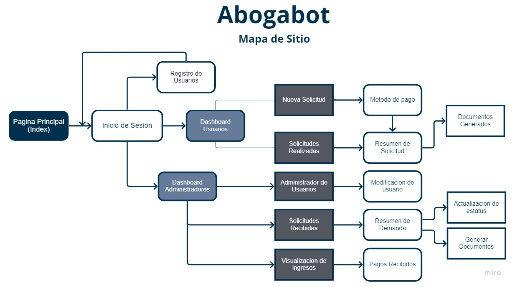
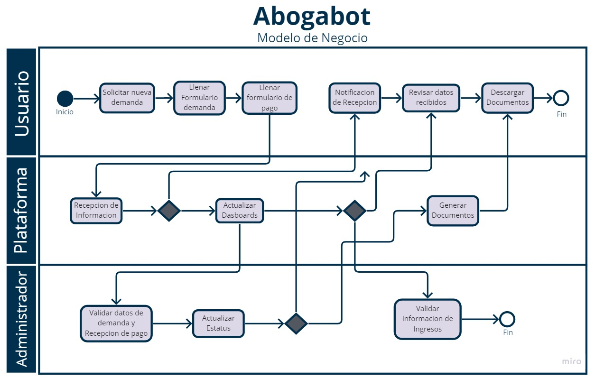

# LaunchX-Abogabot
LaunchX - Practica 1.

## **1. Toma de Requerimientos.**

**Plataforma de Gestion de Demandas.**

El Cliente busca crear una plataforma para que los usuarios puedan crear solicitudes de procesos legales de manera automatizada, para que una vez realizado el pago, el cliente reciba el estatus de se desarolla su demanda.

Dentro de los parametros que el cliente solicita, se identifican los siguientes puntos a desarollar en la plataforma.

**Usuario.**
- Cuenta en la plataforma (Registro).
- Ingreso a la plataforma (Login Usuario).
- Creacion de solicitudes de demandas (Formulario Nueva Demanda).
- Metodos de pago para las solicitudes realizadas (Formulario Pago).
- Visualizacion de los solicitudes ya realizadas (Dashboard de solicitudes).
- Detalles de cada solicitud realizada donde se puedan consultar los avances realizados, comentarios y el estatus actual de la solicitud (Detalle de Demanda).
- Notificaciondes de cada proceso (Por correo o plataforma).

**Administrador.**
- Cuenta en la plataforma (Registro Admin).
- Ingreso a la plataforma (Login Admin).
- Visualizacion de solicitudes procesadas y en cola (Dasboard de Solicitudes).
- Revisar ingresos de pago de las solicitudes (Dashboard de Solicitudes/Pagos).
- Revision de las solicitudes donde pueda agregar comentarios o actualizaciones y cambiar el estatus de cada solicitud.(Detalle de Demanda).
- Notificaciondes de cada nueva demanda o pago (Por correo o plataforma).

**Diseño.**
- Diseño responsive para mejor visualizacion en Moviles.
- Paleta de color Azul mariono y blanco (Abierto a sugerencias).

**Plataforma.**
- Administracion de usuarios de la plataforma (Admins y clientes).
- Notificaciones en la plataforma y por correo.
- Envio de documentos de manera automatizada con los datos del formulario de cada solicitud una vez recibido el pago(Word).

## **2. Diagramas.**
**Mapa de Sitio.**

**Modelo de Negocio.**

